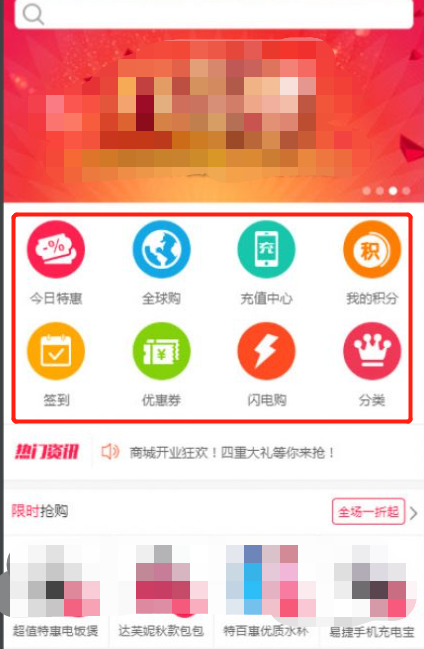
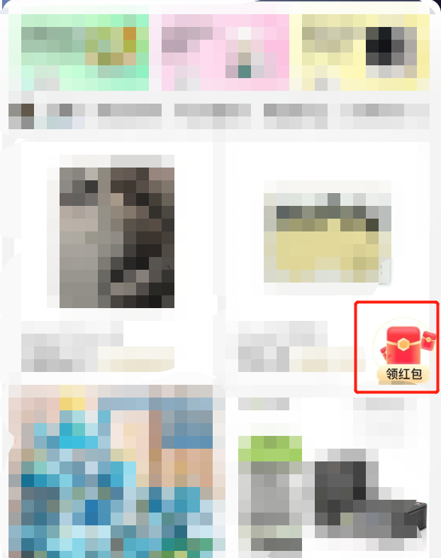
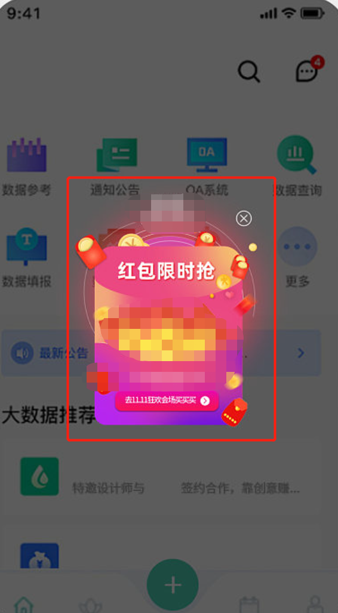
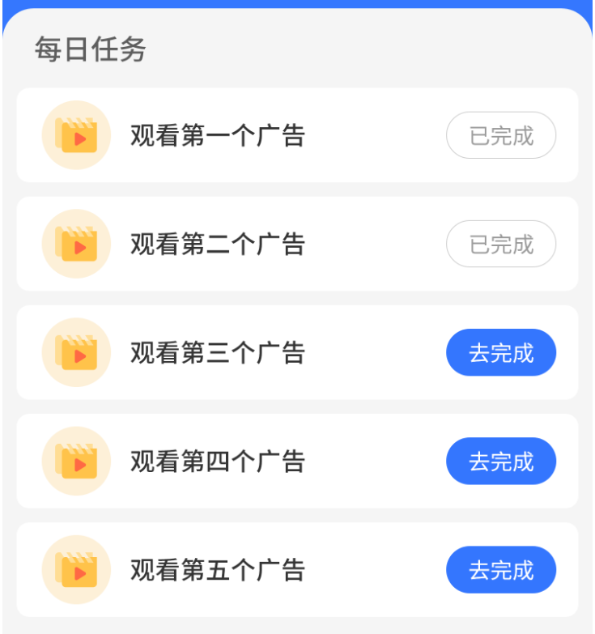
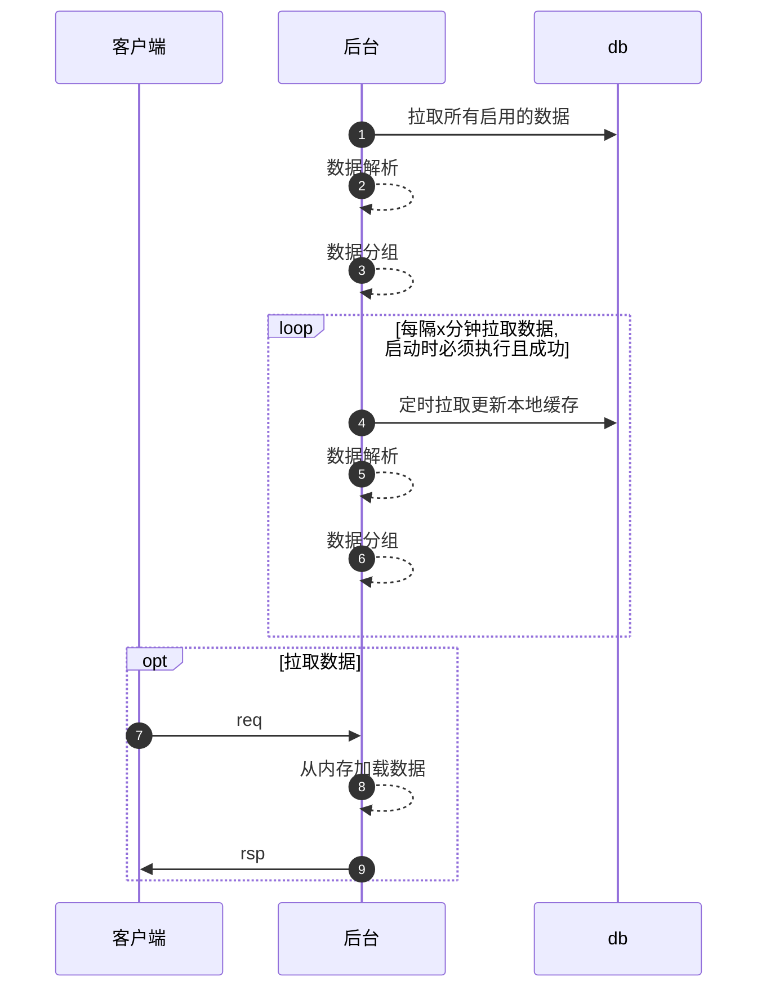

<!-- TOC -->

- [common_button 是什么](#common_button-%E6%98%AF%E4%BB%80%E4%B9%88)
- [术语](#%E6%9C%AF%E8%AF%AD)
    - [module 模块](#module-%E6%A8%A1%E5%9D%97)
    - [scene 场景/页面](#scene-%E5%9C%BA%E6%99%AF%E9%A1%B5%E9%9D%A2)
    - [button 按钮](#button-%E6%8C%89%E9%92%AE)
    - [task_template 任务模板](#task_template-%E4%BB%BB%E5%8A%A1%E6%A8%A1%E6%9D%BF)
    - [task 任务](#task-%E4%BB%BB%E5%8A%A1)
- [高性能秘诀](#%E9%AB%98%E6%80%A7%E8%83%BD%E7%A7%98%E8%AF%80)
    - [用户任务数据储存](#%E7%94%A8%E6%88%B7%E4%BB%BB%E5%8A%A1%E6%95%B0%E6%8D%AE%E5%82%A8%E5%AD%98)
- [前置准备](#%E5%89%8D%E7%BD%AE%E5%87%86%E5%A4%87)
    - [底层组件要求](#%E5%BA%95%E5%B1%82%E7%BB%84%E4%BB%B6%E8%A6%81%E6%B1%82)
    - [sql文件导入](#sql%E6%96%87%E4%BB%B6%E5%AF%BC%E5%85%A5)
    - [修改配置文件](#%E4%BF%AE%E6%94%B9%E9%85%8D%E7%BD%AE%E6%96%87%E4%BB%B6)
- [示例](#%E7%A4%BA%E4%BE%8B)
- [接入](#%E6%8E%A5%E5%85%A5)
    - [接入通用按钮](#%E6%8E%A5%E5%85%A5%E9%80%9A%E7%94%A8%E6%8C%89%E9%92%AE)
    - [接入通用任务](#%E6%8E%A5%E5%85%A5%E9%80%9A%E7%94%A8%E4%BB%BB%E5%8A%A1)
    - [新增任务类型](#%E6%96%B0%E5%A2%9E%E4%BB%BB%E5%8A%A1%E7%B1%BB%E5%9E%8B)
    - [个性化改造](#%E4%B8%AA%E6%80%A7%E5%8C%96%E6%94%B9%E9%80%A0)
- [示例配置](#%E7%A4%BA%E4%BE%8B%E9%85%8D%E7%BD%AE)
    - [一次性纯跳转按钮, 点击跳转后消失, 第二周重新出现](#%E4%B8%80%E6%AC%A1%E6%80%A7%E7%BA%AF%E8%B7%B3%E8%BD%AC%E6%8C%89%E9%92%AE-%E7%82%B9%E5%87%BB%E8%B7%B3%E8%BD%AC%E5%90%8E%E6%B6%88%E5%A4%B1-%E7%AC%AC%E4%BA%8C%E5%91%A8%E9%87%8D%E6%96%B0%E5%87%BA%E7%8E%B0)
    - [每日签到任务, 签到后消失, 第二天重新出现](#%E6%AF%8F%E6%97%A5%E7%AD%BE%E5%88%B0%E4%BB%BB%E5%8A%A1-%E7%AD%BE%E5%88%B0%E5%90%8E%E6%B6%88%E5%A4%B1-%E7%AC%AC%E4%BA%8C%E5%A4%A9%E9%87%8D%E6%96%B0%E5%87%BA%E7%8E%B0)

<!-- /TOC -->

# common_button 是什么	

common_button 是一个通用按钮库, 用于快速方便的创建app上使用的一些按钮. 运营可以在不对app发版的情况下增加/删除/修改按钮.	

for 客户端: 统一接口, 一次对接, 多场景适配.	
for 后台: 一次开发, 东哥配置好实现多场景复用.	
for 运营: 统一管理, 功能广泛, 使用门槛低.	

	

---	

# 术语	

## module 模块	

module 表示一个业务下的一个模块划分, 比如`商城/论坛/用户中心`表示不同的模块	

## scene 场景/页面	

scene 表示不同的场景/页面, 比如用户中心的`个人信息/用户协议`表示不同的页面. 也可以用来区分同一个页面中的不同位置.	

## button 按钮	

button 表示一个场景/页面上可以点击的按钮, 这些简单的按钮不能有复杂的业务逻辑	

## task_template 任务模板	

task_template 用于定义一个任务类型, 比如 跳转/签到/第三方任务, 它是开发者决定的.

## task 任务

task 表示一个任务, 是运营基于 task_template 创建的一个任务实体. task 要依赖于 button 才能显示在客户端上.



---

# 高性能秘诀

1. 所有有效数据常驻内存, 每隔x分支从db加载并刷新到内存中.
2. 首次启动程序必须加载成功, 否则退出程序
3. 后续加载失败会采用最后一次成功的数据(加载失败不会替换内存数据)



## 用户任务数据储存

用户数据储存到redis, 每个用户的每个key为一条string数据, 其key基于按钮id+用户id. 其value大概如下内容

```text
当前周期
任务进度
任务状态
```

---

# 前置准备

## 底层组件要求

- redis 储存用户任务状态, 也可以使用 kvrocks (兼容redis的硬盘储存nosql)
- mysql 储存按钮和任务信息, 可以使用 mysql/mariadb/pgsql 等

## sql文件导入

1. 首先准备一个库名为 `common_button` 的mysql库. 这个库名可以根据sqlx组件配置的连接db库修改
2. 创建导入相关表, 表文件在[这里](./db_table/common_button.sql)

## 修改配置文件

配置内容参考:

```yaml
# common_button 配置
common_button:
   ButtonSqlxName: 'common_button' # 按钮的sqlx组件名
   ReloadButtonIntervalSec: 60 # 重新加载按钮数据的间隔时间, 单位秒
   ButtonTaskDataRedisName: 'common_button' # 按钮任务数据的redis组件名
   ButtonGrpcGatewayClientName: 'common_button' # grpc网关客户端组件名
   UserTaskDataCacheName: '' # 用户任务数据缓存组件名

# 依赖组件
components:
   sqlx: # 参考 https://github.com/zly-app/component/tree/master/sqlx
      common_button:
         Driver: mysql # 驱动, 支持 mysql, postgres, sqlite3, mssql
         Source: 'user:passwd@tcp(localhost:3306)/dbname?charset=utf8mb4&parseTime=True&loc=Local' # 连接源
         # ...
   redis: # 参考 https://github.com/zly-app/component/tree/master/redis
      common_button:
         Address: localhost:6379
         # ...
   grpc: # 参考 https://github.com/zly-app/grpc/tree/master/client
      common_button:
         Address: localhost:3000
         # ...
   cache:
      common_button.user_task_data: # 用户任务数据缓存
         Serializer: sonic_std
         CacheDB:
            Type: bigcache
         # ...

services:
   grpc: # 参考 https://github.com/zly-app/grpc
      Bind: :3000 # bind地址
      # ...
   grpc-gateway: # 网关配置
      Bind: :8080 # bind地址
      # ...
```

---

# 示例

```go
package main

import (
	"github.com/zly-app/grpc"

	_ "github.com/zlyuancn/common_button"
)

func main() {
	app := zapp.NewApp("zapp.test.common_button",
		grpc.WithService(),
		grpc.WithGatewayService(),
	)
	defer app.Exit()

	app.Run()
}
```

运行后会启动一个grpc服务及一个api网关服务. 其pb定义在[这里](./pb/button.proto). 对客户端的api可以提供[swagger文件](./pb/button.swagger.json)

---

# 接入

## 接入通用按钮

后台

1. 在业务模块表 `common_button_module` 中新增本次需求的业务模块, 后续重复使用.
2. 在业务场景/页面表 `common_button_scene` 中新增本次需求的业务场景/页面, 后续重复使用.

运营

1. 在按钮表 `common_button` 中新增业务场景/页面中需要的按钮.

客户端

1. 一次接入, 后续重复使用
2. 使用本次需求所涉及到的 `模块id(module_id)` 和 `场景/页面id(scene_id)` 请求后台接口

## 接入通用任务

后台

1. 在业务模块表 `common_button_module` 中新增本次需求的业务模块, 后续重复使用.
2. 在业务场景/页面表 `common_button_scene` 中新增本次需求的业务场景/页面, 后续重复使用.

运营

1. 根据任务模板表 `common_task_template` 中定义的任务类型, 在任务表 `common_task` 中新增本次需求所需要的任务.
2. 在按钮表 `common_button` 中新增本次需求所需要的按钮, 并关联上创建的任务.

客户端

1. 一次接入, 后续重复使用
2. 使用本次需求所涉及到的 `模块id(module_id)` 和 `场景/页面id(scene_id)` 请求后台接口

## 新增任务类型

在任务模板表 `common_task_template` 中如果不支持本次需求的任务类型, 需要新增一个任务类型, 并注册该任务类型的解决方案.

代码示例...

## 个性化改造

部分业务可能需要对数据做特殊处理, 或者想把按钮数据和其业务数据在一个接口中返回, 开发者可以通过rpc拉取数据并嵌入到自己的业务接口中.

### 奖品解析

业务奖品可能具有自己的数据结构和解析方式(从db加载), 对于数据结构需要修改pb文件 `pb/button.proto` 的 `Prize` 数据类型. 对于奖品的读取方式可以使用 `dao.SetPrizeIDParseFn` 设置为自己的解析函数. 在这个解析函数中不需要为奖品数据加缓存, 因为它每隔一段时间重新加载按钮时才会调用一次奖品解析函数.

---

# 示例配置

这里假定使用者已经创建好了其业务模块(module)和场景\/页面(scene)

## 一次性纯跳转按钮, 点击跳转后消失, 第二周重新出现

待补充...

## 每日签到任务, 签到后消失, 第二天重新出现

待补充...
