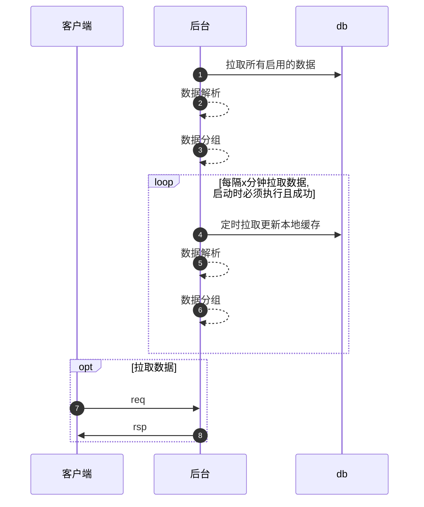

<!-- TOC -->

- [common\_button 是什么](#common_button-是什么)
- [术语](#术语)
  - [module 模块](#module-模块)
  - [scene 场景/页面](#scene-场景页面)
  - [button 按钮](#button-按钮)
  - [task\_template 任务模板](#task_template-任务模板)
  - [task 任务](#task-任务)
- [高性能秘诀](#高性能秘诀)
- [个性化改造](#个性化改造)
- [如何使用](#如何使用)
  - [前置准备](#前置准备)
  - [接入通用按钮](#接入通用按钮)
  - [接入通用任务](#接入通用任务)
  - [新增任务类型](#新增任务类型)

<!-- /TOC -->

---

# common_button 是什么

common_button 是一个通用按钮库, 用于快速方便的创建app上使用的一些按钮. 运营可以在不对app发版的情况下增加/删除/修改按钮.

for 客户端: 统一接口, 一次对接, 多场景适配.
for 后台: 一次开发, 东哥配置好实现多场景复用.
for 运营: 统一管理, 功能广泛, 使用门槛低.

---

# 术语

## module 模块

module 表示一个业务下的一个模块划分, 比如`商城/论坛/用户中心`表示不同的模块

## scene 场景/页面

scene 表示不同的场景/页面, 比如用户中心的`个人信息/用户协议`表示不同的页面. 也可以用来区分同一个页面中的不同位置.

## button 按钮

button 表示一个场景/页面上可以点击的按钮, 这些简单的按钮不能有复杂的业务逻辑

## task_template 任务模板

task_template 用于定义一个任务类型, 比如 跳转/签到/第三方任务, 它是开发者决定的.

## task 任务

task 表示一个任务, 是运营基于 task_template 创建的一个任务实体. task 要依赖于 button 才能显示在客户端上.

---

# 高性能秘诀

1. 所有有效数据常驻内存, 每隔x分支从db加载并刷新到内存中.
2. 首次启动程序必须加载成功, 否则退出程序
3. 后续加载失败会采用最后一次成功的数据(加载失败不会替换内存数据)

---

# 个性化改造

部分业务可能需要对数据做特殊处理, 或者想把按钮数据和其业务数据在一个接口中返回, 开发者可以通过rpc拉取数据并嵌入到自己的业务接口中.

---

# 如何使用

## 前置准备

## 接入通用按钮

后台

1. 在业务模块表 `common_button_module` 中新增本次需求的业务模块, 后续重复使用.
2. 在业务场景/页面表 `common_button_scene` 中新增本次需求的业务场景/页面, 后续重复使用.

运营

1. 在按钮表 `common_button` 中新增业务场景/页面中需要的按钮.

客户端

1. 一次接入, 后续重复使用
2. 使用本次需求所涉及到的 `模块id(module_id)` 和 `场景/页面id(scene_id)` 请求后台接口

## 接入通用任务

后台

1. 无工作

运营

1. 根据任务模板表 `common_task_template` 中定义的任务类型, 在任务表 `common_task` 中新增本次需求所需要的任务.
2. 在按钮表 `common_button` 中新增本次需求所需要的按钮, 并关联上创建的任务.

客户端

1. 一次接入, 后续重复使用
2. 使用本次需求所涉及到的 `模块id(module_id)` 和 `场景/页面id(scene_id)` 请求后台接口

## 新增任务类型

在任务模板表 `common_task_template` 中如果不支持本次需求的任务类型, 需要新增一个任务类型, 并注册该任务类型的解决方案.

代码示例...

---

# 示例配置

## 一次性纯跳转按钮, 点击跳转后消失, 第二周重新出现

待补充...

## 每日签到任务, 签到后消失, 第二天重新出现

待补充...
